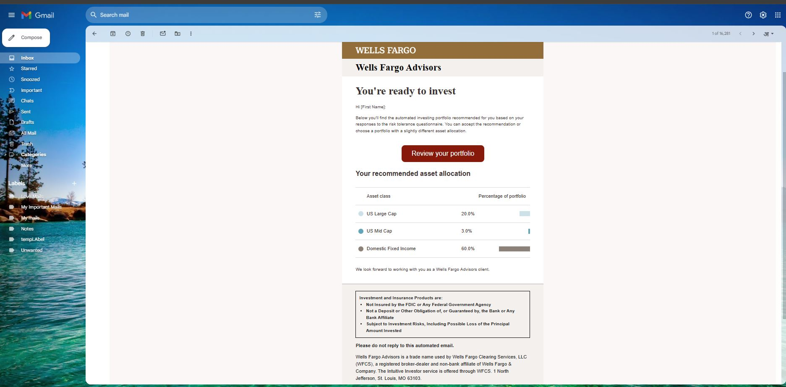
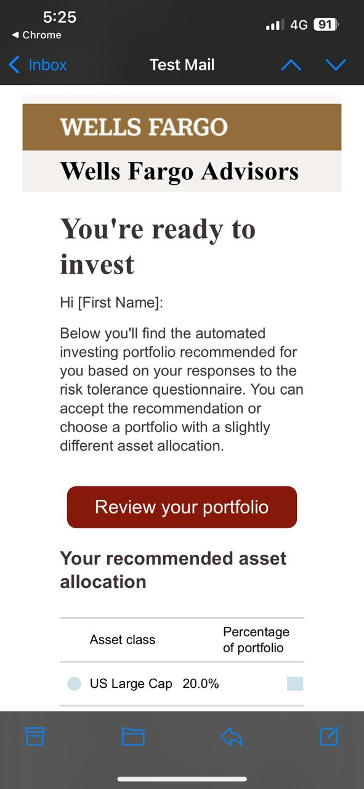
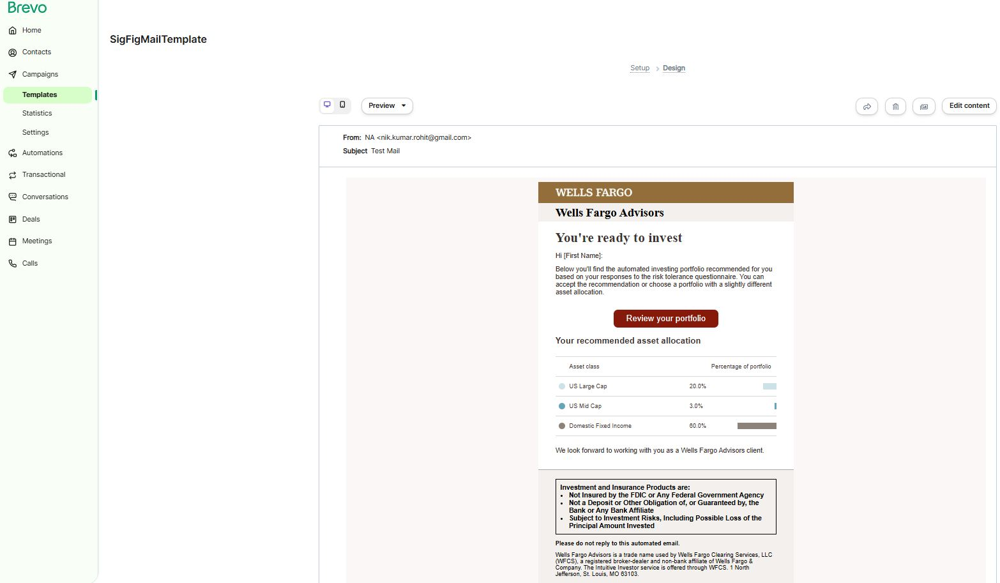
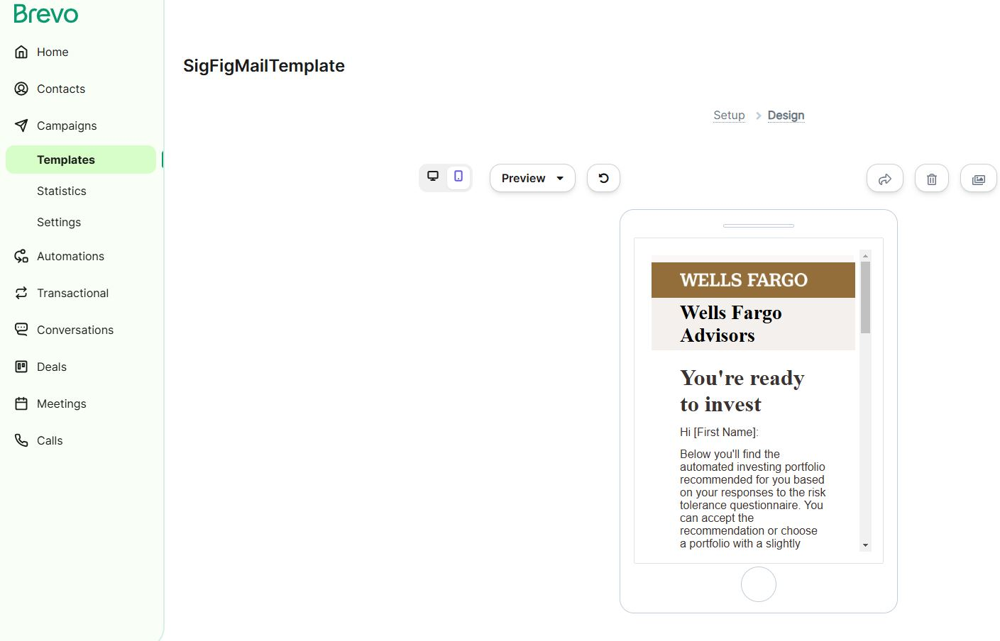

# Responsive HTML email template 

## Tools used

- VS Code Editor
- Github
- Browser Developer Tools
- [Brevo](https://www.brevo.com)

## Technologies used

- HTML
- CSS

## Platform used for testing

- Gmail
- Apple Mail
- Bravo
- Outlook

## Test Images

##### Gmail Mail - Desktop

##### Gmail - Mobile

##### Apple - Mobile

##### Bravo - Desktop

##### Bravo - Mobile

## Email Template Development Challenges

- Style Limitations - No External Stylesheets, No :hover Support, No @media Queries.
- Visual Element Challenges - Creating and aligning mockup graphs within the email body presented a challenge. This was addressed by using p tags and styling them with inline CSS to simulate basic graph elements.

## Development Process

- Initial Structure: A table-based layout was chosen for its reliability in creating responsive email designs.
- Image Handling: Media assets were saved in the assets/images folder using the WebP format for optimal image size and faster loading times.
- Content and Styling: Content was added to the template and formatted using inline styles to match the requirement.
- Button Hover Effect: JavaScript was used to implement button hover effects due to the limited support for the :hover pseudo-class in email clients.
- Testing and Validation: The email template was thoroughly tested across various email clients and devices to ensure consistent rendering and optimal display across different platforms.

## Steps for testing the email template

- Open the `index.html` file.
- Copy Template Content.
- Paste into Email Client.
- Send Test Email.

